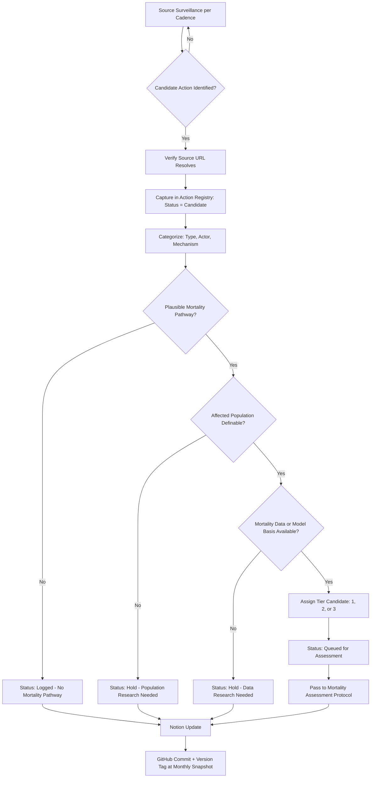

# MAHA Mortality Tracker — Research Protocol v1.1

**Status:** v1.1 DRAFT — 2026-04-27 (updates v1.0 from 2026-04-26 with scope decisions and Substack tooling)
**Owner:** Angie Rasmussen
**Project:** MAHA Mortality Tracker
**Public-facing site name:** Bobby Kennedy Jr. Body Count
**Parent doc:** `MAHA_Mortality_Tracker_Project_Instructions_v1.md`

---

## 1. Purpose

Define the standardized, repeatable workflow for identifying actions attributable to Robert F. Kennedy Jr., his network (Children's Health Defense, allied state actors, allied federal officials), and HHS under his leadership that may have measurable mortality consequences.

This protocol is the **input pipeline** to the Mortality Assessment Protocol (separate document, in development). It produces and maintains the **Kennedy Action Registry** in Notion.

The protocol is run on a recurring schedule (Section 10) and on-demand when triggered by external events.

---

## 2. Scope

### 2.1 In scope

The following classes of actions are eligible for entry into the Kennedy Action Registry:

1. **Official acts of HHS or its sub-agencies** (CDC, FDA, NIH, CMS, HRSA, IHS, ACF, AHRQ, ASPR, BARDA, ACIP, VRBPAC) under Kennedy's leadership.
2. **Public statements by Kennedy** with measurable downstream effects on health behavior, vaccination coverage, or policy adoption.
3. **Activities by Children's Health Defense (CHD)** during Kennedy's chairmanship and during his federal tenure (when CHD activity has documentable population-level effect or policy effect).
4. **Acts by federal officials** confirmed under Kennedy's nomination or appointment chain whose actions implement Kennedy-aligned policy.
5. **State-level actions** by officials with documented connections to Kennedy or CHD (campaign contributions, joint appearances, public endorsements, stated alignment, shared funding sources).
6. **DoD / Department of War actions** affecting health policy where the action chain traces to MAHA priorities or to officials operating in coordination with Kennedy.
7. **Pre-confirmation acts (broad scope, v1.1).** Kennedy's pre-HHS history is in scope. This includes:
   - Samoa 2019 measles outbreak and Kennedy/CHD activity surrounding it
   - All Children's Health Defense activity from CHD's founding (rebranded from World Mercury Project, 2018) onward
   - Pre-CHD World Mercury Project (founded ~2007) activity directed by Kennedy
   - Earlier Kennedy anti-vaccine writing, advocacy, and public statements with documented downstream effect
   - The Registry captures these comprehensively. Whether they advance to mortality assessment depends on the eligibility gates in §7 (mechanism, population, data, time window, counterfactual). Many pre-HHS entries will stay in the Registry as context without becoming mortality counts; that's fine.
8. **International activities (broad scope, v1.1).** International Kennedy/CHD activity is in scope. Examples include CHD activity in low-coverage settings (Africa, Pacific Islands, Europe), international conferences where Kennedy or CHD leadership presented, and international policy advocacy. Same Registry-vs-Assessment distinction applies: log comprehensively, assess where eligibility gates pass.

### 2.2 Out of scope

1. Actions by federal officials with no documented connection to Kennedy, CHD, or MAHA priorities.
2. State actions taken independent of Kennedy/CHD/MAHA-network influence.
3. Generic public health policy debate without specific actor attribution.
4. Speculative attribution chains (e.g., "Kennedy's platform created a climate where X happened" without documentable mechanism).
5. Pre-CHD-era Kennedy biography (e.g., legal career) unless directly connected to a current entry.

### 2.3 Edge cases (case-by-case review)

1. **ACIP votes** where Kennedy-appointed members were swing votes vs. non-swing votes — log with vote breakdown.
2. **State legislative actions with mixed motivation** (general anti-mandate sentiment + documented Kennedy/CHD activity) — log with attribution evidence weighted.
3. **International actions** affecting US populations indirectly.
4. **Allied actor actions** where the alliance is documented but the specific action was not Kennedy-coordinated — log with relationship strength rating.

Edge cases are flagged at capture (`Edge Case Flag` field) and reviewed at monthly registry update.

---

## 3. Action Registry — high-level schema

Detailed schema lives in `Action_Registry_Schema_v1.md`. Core fields summary:

| Field | Type | Purpose |
|---|---|---|
| ID | auto (KAR-NNNN) | Unique identifier |
| Action Name | title | Short descriptive label |
| Date | date | When action occurred |
| Type | select | Schedule change / funding cut / staffing cut / regulatory / EO / communication / state proxy / clinical trial / program termination / nominee / CHD activity / other |
| Actor | multi-select | Kennedy direct / HHS sub-agency / CHD / state official / DoD official / nominee / congressional ally / other |
| Description | rich text | What happened |
| Mortality Pathway | rich text | Biological / epidemiological pathway |
| Source URL | URL | Primary source |
| Source Authority Tier | select | 1 / 2 / 3 |
| Affected Population | rich text + relation | Population at risk |
| Geographic Scope | multi-select | Federal / state / county / international |
| Tier Candidate | select | Tier 1 / 2 / 3 / Not Yet Determined |
| Status | select | Candidate / Logged–No Mortality Pathway / Hold–Population / Hold–Data / Queued for Assessment / Under Assessment / Assessed / Published / Retracted |
| Related MAHA Opps Entry | relation | Federal Policy Changes or State Legislation |
| Related Mortality Assessment | relation | Mortality Assessments DB |
| Edge Case Flag | checkbox + select | For review queue |

---

## 4. Source Surveillance List

Sources are organized by cadence and authority tier.
**Authority Tier 1** = primary (official records).
**Authority Tier 2** = direct verified reporting (established news organizations, academic).
**Authority Tier 3** = secondary analysis, advocacy, social monitoring.

### 4.1 Daily monitoring (~15 min)

| Source | URL / Path | Authority | What to capture |
|---|---|---|---|
| HHS press releases | hhs.gov/about/news | 1 | Statements, policy announcements |
| Federal Register | federalregister.gov | 1 | Rules, notices |
| White House actions | whitehouse.gov/presidential-actions | 1 | EOs, memos |
| AP Health | apnews.com/hub/health | 2 | Major federal health news |
| Reuters Health | reuters.com/business/healthcare-pharmaceuticals | 2 | Same |
| STAT News | statnews.com | 2 | Federal health, pharma, science |
| CIDRAP | cidrap.umn.edu | 2 | Outbreak news |

### 4.2 Weekly monitoring (~1 hour)

| Source | Authority | What to capture |
|---|---|---|
| KFF Health News | 2 | Policy analysis, legislative tracking |
| CMS press + data.cms.gov | 1 | Coverage policy, Medicaid implementation |
| FDA press | 1 | Drug, vaccine, food regulatory actions |
| CDC MMWR | 1 | New surveillance data, outbreak reports |
| Children's Health Defense (chd.tv, childrenshealthdefense.org) | 3 | Press, campaigns |
| CHD social — X (LunarCrush) | 3 | Major posts, campaign launches |
| Substack search (Claude-side, via site-restricted WebSearch) | 3 | Posts about/by Kennedy, CHD, aligned voices, public health writers — see §4.5 |
| State health department press (target states) | 1 | Regulatory actions |
| LunarCrush — Kennedy + CHD topic monitoring | 3 | Sentiment, engagement |
| HHS OIG | 1 | New reports, investigations |
| GAO Health | 1 | New reports |

### 4.3 Monthly comprehensive review (~half day)

| Source | Authority | What to capture |
|---|---|---|
| HHS staffing changes (RIFs, appointments) — OPM, OMB | 1 | Memos, dataset updates |
| ACIP meeting minutes & recommendations | 1 | Votes, schedule changes |
| VRBPAC meeting minutes | 1 | Vaccine review actions |
| State legislative trackers — Ballotpedia, NCSL | 2 | Bills moving in target states |
| Congressional Record (Health committees) | 1 | Hearings, testimony, letters |
| PACER court filings (CHD as plaintiff/defendant) | 1 | New filings, rulings |
| CHD 990 filings (annual) | 1 | Funding, expenditures, network mapping |
| Substack target list (manual deep read of curated Substacks; see §4.5) | 3 | Content with measurable reach from a maintained target list |
| NIH RePORTER terminated grants | 1 | Trial halts, program cuts |

### 4.5 Substack monitoring (v1.1 — Claude-side, weekly)

LunarCrush does not cover Substack. Substack monitoring runs on Claude's side via site-restricted web search, integrated into the weekly synthesis pass:

- **Broad search.** Each weekly cycle, run site-restricted WebSearch like `site:substack.com "RFK Jr"`, `site:substack.com "Children's Health Defense"`, `site:substack.com "ACIP"`, plus topical searches for active outbreaks, vaccine policy events, and other Registry-relevant developments. This catches posts across all Substacks at once.
- **Targeted reads.** Maintain a Target Substack List of writers worth a dedicated read each cycle: Kennedy / CHD-aligned voices on one side; public health, virology, and vaccine-policy writers on the other. The list is maintained as part of the Sources Library Notion DB.
- **Capture.** Posts that meet Registry criteria are captured per the standard workflow (§6). Authority Tier 3 by default; require corroboration from a Tier 1 or 2 source for downstream advancement.
- **No user-side manual browsing.** The user does not browse Substack directly as part of this workflow. Claude produces a weekly synthesis with relevant captures and summaries.

### 4.6 Triggered runs

Run a focused surveillance pass within 48 hours when:
- Major outbreak declared (any VPD, plus H5N1/HPAI human cases)
- ACIP / VRBPAC vote
- HHS leadership change or RIF announcement
- New EO touching health, science, or food
- Congressional hearing involving Kennedy or HHS leadership
- Court ruling involving CHD or HHS
- Major investigative exposé
- Major Kennedy public appearance with policy content
- Significant international Kennedy or CHD activity

---

## 5. Search Workflow



---

## 6. Capture and Triage Workflow

### 6.1 Initial capture
For each candidate action:
1. **Verify** source URL resolves at the time of capture (do not embed unverified URLs from memory).
2. **Create entry** in Kennedy Action Registry with `Status = Candidate`.
3. **Populate required fields**: Date, Type, Actor, Description, Source URL, Source Authority Tier.
4. **Duplicate check**: Notion search by date (±7 days) + actor + keyword.

### 6.2 Categorization
Set:
- **Type**: schedule_change, funding_cut, staffing_cut, regulatory_action, executive_order, communication, state_proxy, clinical_trial_action, program_termination, nominee_action, CHD_activity, other
- **Actor**: kennedy_direct, hhs_subagency, chd_org, state_official, dod_official, nominee, congressional_ally, other
- **Mechanism**: free text + tag — how the action could affect mortality (biological / epidemiological / access-to-care / surveillance-degradation / etc.)

### 6.3 Triage gates
Apply gates per Section 5 flowchart. Move status accordingly.

### 6.4 Tier candidate assignment
Apply Tier rubric (Section 8). Set `Tier Candidate` field.

---

## 7. Assessment Eligibility Criteria

An action moves from registry to mortality assessment only when **ALL** the following are met:

1. **Documentable causal mechanism** — defensible biological or epidemiological pathway from action to mortality.
2. **Definable affected population** — population at risk specifiable by geography, demographics, or health condition.
3. **Available mortality data or model basis** — direct mortality counts exist, OR a peer-reviewed model framework can produce a defensible estimate.
4. **Time window definable** — period over which mortality is attributed is bounded.
5. **Counterfactual specifiable** — what would have happened without the action can be defined (estimated is OK).

Actions failing any gate are held with documented reason. Held items are reviewed at monthly registry update.

---

## 8. Tier Assignment Rubric

### Tier 1 — Documented causal chain
ALL criteria met:
- Action documented in primary sources.
- Mechanism documented (specific intervention, measurable behavioral or coverage change, outbreak following).
- Affected population identified by name (specific country, state, county, cohort).
- Deaths counted and reported by official sources.
- Causal chain defensible end-to-end without additional statistical inference.

**Example:** Samoa 2019 measles outbreak — 83 deaths, documented coverage drop following Kennedy/CHD activity, Samoan government death counts.

### Tier 2 — Statistical attribution
- Action documented.
- Mechanism documented at population level.
- Excess mortality estimable using accepted epidemiological methods (counterfactual baseline).
- Confidence interval can be specified.

**Examples:** US measles deaths attributable to coverage decline in states with documented CHD/Kennedy activity. OBBBA Medicaid coverage-loss deaths. ACIP MMRV change projected impact in coming year.

### Tier 3 — Projected mortality
- Action documented.
- Mortality estimate based on peer-reviewed forward-looking modeling.
- No retrospective deaths yet measurable.
- Clearly labeled as projected.

**Examples:** Long-horizon (5–10 yr) coverage-loss mortality projections; forward-looking VPD resurgence models from withdrawn vaccine recommendations.

---

## 9. Quality Control

### 9.1 Per-entry QC (at capture)
- URL verified to resolve at capture.
- Source authority tier assigned (minimum tier 2 for entry; tier 3 sources require corroboration from another tier 2+ source).
- Duplicate check performed.
- Attribution chain documented for influence-based actions (which sources establish the connection).
- Type, Actor, Mechanism populated.

### 9.2 Monthly QC pass
- Re-verify URLs of all entries captured in the past 30 days.
- 10% random-sample audit for completeness against schema.
- Resolve held items where new data is available.
- Update Notion view with current status counts.
- Log QC results in `qc_log.md` in the GitHub repo.

### 9.3 Public-facing entry QC
Triggered when an entry advances to `Published` (governed by Mortality Assessment Protocol):
- Methodology peer review (if Tier 2/3) or chain documentation review (Tier 1).
- Citation completeness check.
- Editorial review for tone (factual reporting, not advocacy).
- URL re-verification immediately before publishing.

---

## 10. Periodic Update Schedule

| Cadence | Activity | Time budget |
|---|---|---|
| **Daily** | News scan: Federal Register, HHS press, AP/Reuters/STAT, CIDRAP — capture candidates | ~15 min |
| **Weekly** | Synthesis: triage daily candidates, weekly source pass, LunarCrush sentiment review | ~1 hour |
| **Monthly** | Comprehensive review: full source list, registry QC, held-item resolution, version snapshot | ~half day |
| **Triggered** | Targeted run on major events (Section 4.4) | as needed |

Schedule blocks placed on calendar. Skipped runs logged with reason in `surveillance_log.md`.

---

## 11. Version Control

### Protocol versioning
- **Major version** (v1.0 → v2.0): structural changes to scope, tier definitions, or workflow.
- **Minor version** (v1.0 → v1.1): clarifications, source additions, edge-case decisions.
- Each version has a change-log entry at the bottom of this document.
- Protocol version in effect at the time of an entry's capture is recorded on the entry.

### Registry snapshots
- End-of-month snapshot: export full registry state to GitHub as `registry/snapshots/registry_YYYY-MM.csv` (and `.json`).
- Tag commit `registry-YYYY-MM`.
- Snapshots are read-only. Corrections go forward.

### Public site sync
- Site reads from a curated `public/` slice of the registry, exported on a separate cadence (controlled by Mortality Assessment Protocol).
- Site updates tracked in `site/changelog.md` with version tags.

---

## 12. Tools and Infrastructure

### Notion
- **Parent page:** MAHA Mortality Tracker (new — separate from MAHA Opps Tracker)
- **New databases:** Kennedy Action Registry, Mortality Assessments, Affected Populations, Mortality Models, Public Site Entries, Sources Library, Methodology Notes
- **Read-only relations** to MAHA Opps Tracker databases: States, Districts, Disease Tracker, Federal Policy Changes

### GitHub
- **Repo:** `maha-mortality-tracker` (private during build; public when Phase 3 ships)
- **Layout:**
  ```
  /
    protocols/
      research_protocol_v1.0.md      <-- this doc
      assessment_protocol_v0.1.md    <-- in development
      methodology/
        tier1_documentation.md
        tier2_methodology.md
        tier3_methodology.md
    models/
      coverage_to_outbreak/
      coverage_loss_mortality/
      response_capacity/
      trial_termination/
    registry/
      snapshots/
      schema.json
    site/
      public/
      changelog.md
    scripts/
      surveillance/
      qc/
      export/
    logs/
      surveillance_log.md
      qc_log.md
  ```

### Google Drive
- Master Summary doc (cross-action reporting)
- Methodology working files
- External references library (where docs are not URL-accessible)

---

## 13. Checklists

### 13.1 Daily news scan
- [ ] Federal Register new actions reviewed
- [ ] HHS press releases reviewed
- [ ] White House actions page reviewed
- [ ] AP / Reuters / STAT health headlines reviewed
- [ ] CIDRAP reviewed
- [ ] Candidates captured to registry with verified URLs
- [ ] Time-stamped log entry made in `surveillance_log.md`

### 13.2 Weekly synthesis
- [ ] All daily-cadence sources reviewed for the week
- [ ] Weekly-cadence sources reviewed (KFF, FDA, CDC MMWR, CHD, CMS, HHS OIG, GAO)
- [ ] LunarCrush Topic + Topic_Posts pulled for "RFK Jr", "Children's Health Defense", "ACIP", and active outbreak topics
- [ ] Substack site-restricted WebSearch run for Kennedy / CHD / ACIP / active outbreak topics
- [ ] Target Substack List read (see §4.5)
- [ ] All candidates from past 7 days triaged
- [ ] Held items reviewed for new data availability
- [ ] Notion registry updated; status counts verified
- [ ] Weekly summary entry in `surveillance_log.md`

### 13.3 Monthly comprehensive run
- [ ] All weekly tasks completed
- [ ] Monthly-cadence sources reviewed (Section 4.3)
- [ ] State legislative trackers reviewed for target states
- [ ] Congressional Record reviewed for relevant hearings/testimony
- [ ] PACER search for new CHD-related filings
- [ ] CHD 990 review (if filing month)
- [ ] All registry entries from past 30 days URL-reverified
- [ ] 10% random-sample QC audit completed
- [ ] Held items audit completed
- [ ] Registry snapshot exported to GitHub
- [ ] Version-tagged commit pushed
- [ ] Master Summary doc updated
- [ ] Open questions log reviewed and updated

### 13.4 Per-action capture
- [ ] Source URL verified to resolve
- [ ] Date, Type, Actor, Description populated
- [ ] Mechanism specified
- [ ] Source Authority Tier assigned
- [ ] Duplicate check performed
- [ ] Categorization fields populated
- [ ] Triage gates applied
- [ ] Tier Candidate assigned (if `Queued for Assessment`)
- [ ] Status set
- [ ] Edge Case Flag reviewed
- [ ] Notion entry saved

### 13.5 Triggered run
- [ ] Trigger logged with date, type, source
- [ ] Focused source pass on relevant categories
- [ ] All identified candidates captured within 48 hr
- [ ] Triggered-run summary added to `surveillance_log.md`

---

## 14. Open Questions

**Resolved in v1.1:**
- ~~Substack monitoring tooling~~ → resolved: Claude-side site-restricted WebSearch, weekly cadence, no user manual browsing (§4.5).
- ~~Pre-HHS attribution boundary~~ → resolved: broad scope, includes CHD founding era and pre-CHD World Mercury Project (§2.1 item 7).
- ~~International scope~~ → resolved: in scope (§2.1 item 8).
- ~~Triggered-run latency target~~ → resolved: 48 hours (§4.6).

**Still open (to resolve in v1.2):**
1. **Automation level for daily news scan** — RSS aggregator vs. manual? Does Cowork have scheduled tasks we can use?
2. **CHD network mapping** — how much network research is in-scope for the registry vs. a separate tracker DB?
3. **Coordinator role** if/when team expands beyond solo.
4. **Target Substack List** — actual list of writers/feeds to read each cycle (Sources Library DB seed).
5. **LinkedIn / Threads / Truth Social** — LunarCrush doesn't cover these. Chrome browser tools needed but slower. Acceptable cadence?

---

## 15. Version History

| Version | Date | Changes |
|---|---|---|
| v1.0 DRAFT | 2026-04-26 | Initial protocol. Three-tier evidence framework. Federated Notion architecture. Cadence: daily news scan / weekly synthesis / monthly comprehensive / triggered. |
| v1.1 DRAFT | 2026-04-27 | Pre-HHS scope expanded to broad (CHD founding era, pre-CHD WMP, earlier Kennedy advocacy). International scope expanded to in. Substack monitoring moved Claude-side via site-restricted WebSearch (§4.5). Triggered-run latency set to 48 hr. Added international Kennedy/CHD activity to triggered-run criteria. Open question list reorganized into resolved vs. still open. |

---

*End of Research Protocol v1.1 DRAFT.*
